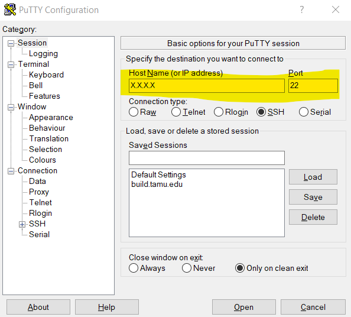

# Running a Modded Minecraft Server on a Raspberry Pi

This is just a document describing how to run a modded minecraft server on a Raspberry Pi. These instructions were tested on a Raspberry Pi 4. 

With a Raspberry Pi running your modded Minecraft server, you can have it run all the time (or whenever you want) for yourself or friends to connect to and play. No need to pay for a subscription on a hosting playform, just the upfront cost of the hardware. 

## What you will need
- Raspberry Pi with at least 4 GB of RAM (I used 8)
- Power cable for Raspberry Pi 
- A 32 GB microSD card
- Ethernet cable 

## What this document covers
- Setting up an Ubuntu Server on a Raspberry Pi
- Installing and running the Forged Server for Minecraft
- Installing Mods 

# Setting Up the Raspberry Pi

## Installing Ubuntu Server

1. Download and install Raspberry Pi Imager. Get the one for your computer from [here](https://www.raspberrypi.org/software/).
2. Connect your microSD card to your computer 
3. Run the Raspberry Pi Imager and choose "Select OS". Choose Ubuntu and then the latest 64 bit version of Ubuntu Server. At the time of writing this, it is Ubuntu Server 20.10. 
4. Select the microSD card and click write. 
5. Wait for the process to finish 

[Reference](https://ubuntu.com/tutorials/how-to-install-ubuntu-on-your-raspberry-pi#1-overview)

## Making The Server Headless 
In this part, we will set up the Ubuntu server "headless", meaning it will not need its own peripherals (keyboard, mouse, monitor). Rather, we will ssh (remote) into it from another computer on the network.

1. With the microSD card inserted into your computer, open the **boot** directory on the card.
2. Create a new file called "ssh". 

[Reference](https://linuxhint.com/raspberry_pi_headless_mode_ubuntu/)

## Starting the Raspberry Pi
1. Insert he microSD card into the Pi and close its housing if you have one. We are ready to deploy it.
2. Set the Raspberry Pi close to your router and plug it into an open port using an Ethernet cable.
3. Connect the power cable to the wall and plug it into the Pi. Now the device will power on. 

### Connecting to the Pi 

Next, you must find the IP address of the Raspberry Pi in order to connect to it. You may log into your router to find it. The instructions to log into your router will be different based on the model. You will need to log into the router to properly set up the Minecraft server.

Once you have the IP Address of your Raspberry Pi, you can connect to it via SSH. 

#### Finding the IP Address of the Pi
Another way to find the IP address is to do the following.

##### On Linux/Mac:
```
arp -na | grep -i "b8:27:eb"
```
and if that does not work, do this instead:
```
arp -na | grep -i "dc:a6:32"
```

##### On Windows:

Try 
```
arp -a | findstr b8-27-eb
```
and if that doesn't work: 
```
arp -a | findstr dc-a6-32
```

#### SSH using Linux/macOS 
If you are on a Linux machine or a Mac, you can open the terminal and run the conmmand:
```
ssh ubuntu@PiIpAddress
```

#### SSH using Windows 
If you are on a Windows machine, you may use the Windows Subsystem for Linux (WSL) or use [PuTTY](https://www.putty.org/). If you are using the WSL, it is assumed you know how to launch the Linux terminal and then use the Linux section above. 

If you do not have the WSL, then use PuTTY. Download it from [here](https://www.putty.org/) and install it. 

Run PuTTY and enter the IP address of the Pi into the Host Name box and make sure the port is set to 22.



Click Open, and when asked for the login name, type Ubuntu. 

### Initial Setup 

When you SSH into the Pi for the first time, if you are asked to change the default password, go ahead and change it. Remember this password for when you need to SSH into the Pi later. 

\* Note -- you will not see anything when you type a password into the terminal.

#### Update your Ubuntu Server 
First, you will update the operating system: 
```
sudo apt install update && sudo apt upgrade -y
```


# Installing The Minecraft Server (Forged)
This section covers how to install and run the Forged server. 

## Environment Setup 
SSH into your Pi and follow the instructions below. 
### Install Java 
You will need to install Java before doing anything else. 

If you need JDK 8 for your preffered version of Minecraft, use this command:
```
sudo apt install openjdk-8-jdk
```

If your preffered version of Minecraft is newer and requires Java 11, use this command:
```
sudo apt install default-jre
```

You may verify Java install properly by checking the version installed:
``` 
java -version
```

### Get Ubuntu Ready
Just in case anything new has happend. 
```
sudo apt update && sudo apt upgrade -y
```

#### Install Screen
```
sudo apt install screen
```


[Reference](https://www.linuxnorth.org/minecraft/modded_linux.html)

[Reference 2](https://www.arubacloud.com/tutorial/how-to-install-mods-on-a-minecraft-server-with-ubuntu-20-04.aspx)